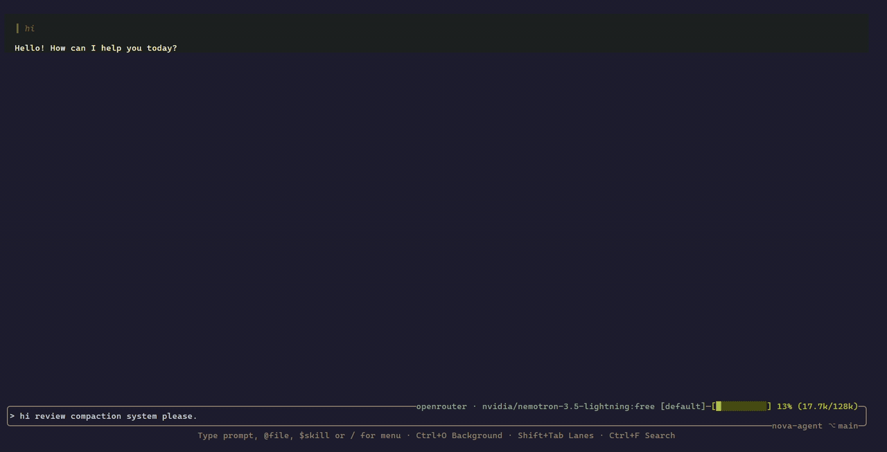

<div align="center">

# Nova

**The fast, keyboard-first, native terminal AI agent for shipping code.**

[](https://ziglang.org)
[](https://github.com/ozgurulukir/nova-agent/releases)
[](LICENSE)
[](https://github.com/ozgurulukir/nova-agent/stargazers)

</div>

---

## ⚡ Nova in action

<p align="center">
  <a href="assets/demo.gif">
    
  </a>
  <br />
  <sub>⚡ <em>Preview snippet. <a href="assets/demo.gif">Click to watch the full demo (18 MB)</a></em></sub>
</p>

Nova is an **oldschool, terminal-native AI agent** designed for pure speed and focus. No Electron, no browser tab, no heavy Node runtime. Just a single, compiled Zig binary that interfaces directly with your shell, connects to any OpenAI-compatible provider, orchestrates parallel work across isolated git worktree lanes, and logs every turn to local SQLite.

> [!IMPORTANT]
> **Beta software:** The core architecture is stable and daily-driven, but APIs, keybindings, and config schemas are evolving toward 1.0.

---

## 🏎️ Philosophy & Execution Model: Autonomous by Default ("YOLO Mode")

Unlike IDE plugins that interrupt you with modal dialogues for every file read or harmless directory scan, Nova operates under an **autonomous execution model** (similar to popular "YOLO" or "dangerously skip permissions" workflows):

- **No tedious click-prompts:** Reads, edits, builds, and standard commands run immediately without micro-confirmations.
- **Two-Tier Command Safety Net:**
  - **Tier 1 — ModernBERT ML Classifier (Active when configured):** When the optional ModernBERT ONNX model is set up, a dedicated local neural classifier inspects every shell command in sub-milliseconds to distinguish benign tasks from dangerous ones with deep contextual awareness.
  - **Tier 2 — Deterministic Pattern Fallback (Active by default):** If the ML model is not installed, Nova relies on its built-in regex/keyword safety engine. This fallback intercepts common high-risk destructive commands (e.g. `rm -rf`, `mkfs`, `dd`, `git reset --hard`, fork bombs) and gates them behind explicit approval prompts.
  - *Runtime Check:* You can inspect your active safety tier at any time by running `/status`.
- **Git Worktree Isolation:** When exploring risky changes or broad refactors, fork your workspace into isolated **Parallel Lanes** (`/parallel` or `lane spawn`). Workers are physically contained inside their worktree, keeping your main branch clean.
- **Plugin Sandboxing & Execution Layer:**
  Nova's Lua plugin environment is an **embedded execution layer** rather than a heavyweight OS container (such as Docker or chroot). Unsafe standard libraries (`io`, `os.execute`, `package.loadlib`) are stripped. All filesystem operations route through Zig bridge functions with strict workspace path confinement (`sanitizePath`), per-dispatch instruction budgets prevent runaway loops, and module loading (`nova.require`) is strictly confined to the plugin's own directory.

> [!CAUTION]
> **Security Notice:** Because Nova executes shell commands directly without granular per-action permission prompts, run it only in workspaces you trust, or confine experimental workflows to parallel git worktree lanes.

---

## ✨ Key Highlights

- **Native TUI with VXFW:** Instant startup, fluid scrolling, custom color themes, and zero web stack bloat.
- **Any LLM Provider:** First-class support for OpenAI, Anthropic, Ollama, llama.cpp, OpenRouter, Cerebras, DeepSeek, and custom OpenAI-compatible endpoints.
- **Parallel Git Lanes:** Run multiple agent threads simultaneously in isolated git worktrees; monitor progress and merge results back when ready.
- **Background Jobs:** Launch long-running builds, test suites, or dev servers asynchronously (`run_in_background: true`). Inspect live logs (`tail`), check progress (`status`), or cancel processes (`cancel`) via the native `background` tool or the `Ctrl+O` dashboard.
- **Context Compaction:** Dynamic, token-calibrated retention budgets that automatically summarize long sessions below model watermark limits.
- **Extensible via Lua & MCP:** Add custom tools and hooks with sandboxed Lua plugins (workspace-confined execution layer with instruction limits) or standard Model Context Protocol (MCP) servers (stdio or Streamable HTTP).
- **Offline & Local-First:** Complete conversation trees persisted in SQLite; full timeline branching (`/timeline`), session resume, and Markdown export.

---

## 📋 Prerequisites & Tooling

### Core Requirements
| Tool | Purpose | Installation |
|:---|:---|:---|
| **[Zig 0.16.0](https://ziglang.org/download/)** | Native compilation and build toolchain | `scoop install zig` / `brew install zig` / [Release](https://ziglang.org/download/) |
| **[Git](https://git-scm.com/)** | Version control & parallel git worktree lanes | Pre-installed or package manager |
| **Shell** | Command execution & worker dispatch | **Windows:** PowerShell 7+ (`pwsh`)<br/>**Linux/macOS:** Bash (`/bin/bash`) |

### Optional Tooling for Plugins & ML
| Tool | Purpose | When Needed |
|:---|:---|:---|
| **[ripgrep (`rg`)](https://github.com/BurntSushi/ripgrep)** | High-speed regex code search | Used by `search-tools` plugin when `regex: true` (`scoop install ripgrep` / `brew install ripgrep` / `apt install ripgrep`). Substring search uses built-in walker with 0 dependencies. |
| **[uv](https://github.com/astral-sh/uv) & Python** | Neural model export pipeline | Only when downloading and exporting the optional ModernBERT ONNX safety model. |

---

## 🚀 Quick Start

### 1. Build and Run from Source

```bash
git clone https://github.com/ozgurulukir/nova-agent.git
cd nova-agent

# Build and run directly
zig build run
```

### 2. Install to PATH

```bash
zig build install -Doptimize=ReleaseFast --prefix $HOME/.local
nova --version
```

---

## 🛡️ Setting Up the ModernBERT Safety Classifier (Optional)

Nova includes a fine-tuned **ModernBERT ONNX model** trained on over 3,000 shell commands to detect unsafe operations with sub-millisecond inference latency.

> [!NOTE]
> The ONNX classifier is **optional**. If omitted, Nova automatically and seamlessly falls back to its built-in local pattern-matching safety engine.

**Prerequisites:** [uv](https://github.com/astral-sh/uv) (Python package manager) and `huggingface-cli`

```bash
# 1. Download model weights
hf download P0u4a/ModernBERT-bash-classifier --local-dir vendor/local-models/ModernBERT-bash-classifier

# 2. Export ONNX graph
uv run --project vendor/local-models python vendor/local-models/export_onnx.py \
  --model-dir vendor/local-models/ModernBERT-bash-classifier \
  --output vendor/local-models/ModernBERT-bash-classifier/model.onnx
```

When present, Nova automatically launches the local inference worker on startup (configured with `OMP_WAIT_POLICY=PASSIVE` to prevent CPU spin).

---

## ⌨️ Essential Keyboard Shortcuts & Commands

| Shortcut | Action |
|:---|:---|
| `/` | Open command palette (`/connect`, `/model`, `/parallel`, `/diff`, `/timeline`, `/help`) |
| `@file` | Attach file contents directly into the prompt |
| `$skill` | Invoke a specialized agent skill |
| `Ctrl+O` | Open Background Jobs & Log Viewer modal |
| `Shift+Tab` | Cycle between active parallel lane conversations |
| `Ctrl+L` | Toggle fullscreen / split lane view |
| `Ctrl+F` | Search within the current transcript |
| `Ctrl+↑ / Ctrl+↓` | Navigate prompt history |
| `Tab` | Expand / collapse active message blocks |
| `Esc` | Cancel current turn / dismiss modal |

---

## 📚 Documentation & Wiki Index

For in-depth guides, architecture specifications, and configuration references:

- 🏛️ **[System Architecture](docs/ARCHITECTURE.md):** TUI event pipeline, LLM client layers, ModernBERT classifier, and memory models.
- ⚙️ **[Configuration Reference](docs/CONFIG.md):** Providers, API keys, context compaction, reasoning effort, and custom theme schemas.
- 🧠 **[Engineering Patterns & Invariants](docs/PATTERNS.md):** Strict-mode tool calling, background slots, zero-copy pruning, and thread-safety invariants.
- 🔌 **[Model Context Protocol (MCP)](docs/MCP.md):** Connecting stdio and Streamable HTTP MCP servers.
- 🧩 **[Lua Plugin System](docs/plugins/):** Building custom tools, event hooks, and system prompt extenders.
- 🎯 **[Design Philosophy](docs/PHILOSOPHY.md):** Core principles guiding Nova's evolution.
- 🛠️ **[Agent & Contributor Guidelines](AGENTS.md):** TigerStyle rules, Zig 0.16 idioms, and testing instructions.
- 📦 **[Releasing & Distribution](docs/RELEASING.md):** Version tagging and release workflow.

---

## 💻 Platform Support

- **Linux / macOS:** Fully supported and tested daily.
- **Windows:** Compiles natively (`zig-out/bin/nova.exe`). Core features, TUI, and SQLite persistence are active; full cross-platform runtime parity is tracked in [#26](https://github.com/ozgurulukir/nova-agent/issues/26)–[#29](https://github.com/ozgurulukir/nova-agent/issues/29).

---

## 📄 License

Nova is open source under the [MIT License](LICENSE). Third-party components and licenses are listed in [attribution.md](attribution.md).
