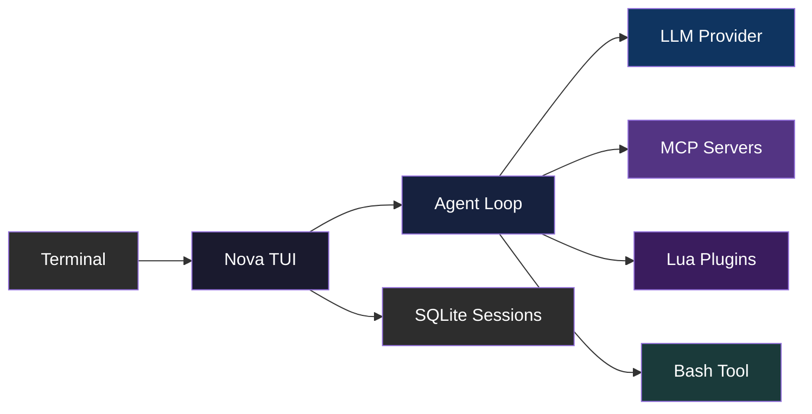

<div align="center">

# Nova

**The terminal AI agent for shipping code.**

[](https://ziglang.org)
[](LICENSE)
[](https://github.com/ozgurulukir/nova-agent/stargazers)

</div>

<!--
  README-ASSET-TODO: Replace the inline demo below with a real terminal
  recording (GIF via gifski, or asciinema SVG, ~1200px wide, <15s).
-->

## Nova in action

```text
$ nova

you>  Why does this PR change the cache eviction policy?

agent> Let me find how the cache is managed.

       bash: rg -n "evict|cache" src --type zig
       → src/cache.zig:42:  fn evict(lru: *Lru, key: []const u8) void

agent> The PR replaces random sampling with LRU eviction so hot keys survive
       compaction. The change is isolated to src/cache.zig:42 and covered by
       the test in src/cache_test.zig:11.
```

Nova is a native terminal UI for working with AI coding agents. It runs in your terminal — no Electron, no browser tab, no Docker. Just a Zig binary that connects to any OpenAI-compatible provider, manages parallel conversation lanes, and keeps your session history in SQLite.

> [!WARNING]
> Alpha software. Things break. Things change. Things get better.

## Why Nova?

- **Runs where you already work.** A native TUI built with [VXFW](https://github.com/vaxis/vaxis) — no Electron, no web stack, no container to babysit.
- **Local-first.** Every conversation is recorded in a SQLite database on your machine. Resume any session later, browse its full timeline, or export it as Markdown.
- **Bring your own provider.** OpenAI Codex, Anthropic, or any OpenAI-compatible endpoint (Ollama, llama.cpp, OpenRouter, Cerebras, ...). Bring your own key, no lock-in.
- **Think in parallel.** Fork your workspace into lanes, run several agents side by side, merge the winner back into the main line.
- **Safe by default.** Dangerous shell commands are gated by a classifier with a built-in local backstop — anything destructive waits for your approval.
- **Extensible.** Sandboxed Lua plugins and MCP servers add tools and data sources without touching the core.

## Features

| Feature | Description |
|---------|-------------|
| **Terminal-native TUI** | Built with [VXFW](https://github.com/vaxis/vaxis) — no Electron, no web tech, just your terminal |
| **Any AI provider** | OpenAI, Anthropic, or any OpenAI-compatible endpoint. Bring your own key. |
| **Parallel lanes** | Fork worktrees into side-by-side agent conversations; merge when ready |
| **Diff viewer** | Full-screen git diff review with inline comments sent back to the agent |
| **MCP tool integration** | Connect any [Model Context Protocol](https://modelcontextprotocol.io) server — stdio or remote |
| **Lua plugin system** | Extend Nova with sandboxed Lua plugins — filesystem, git, JSON, custom tools |
| **Session persistence** | Full conversation history in SQLite. Resume any session, any time. |

## Getting around

Type a prompt and press Enter. A leading `/` opens the command palette; `@file` attaches a file's contents, `$skill` invokes a skill.

| Shortcut | What it does |
|----------|--------------|
| `/` | Open the command palette |
| `@file` | Attach a file's contents to the prompt |
| `$skill` | Invoke a specialized skill |
| `Ctrl+F` | Search the current transcript |
| `Ctrl+O` | Background jobs & logs |
| `Shift+Tab` | Cycle through parallel lanes |
| `Ctrl+L` | Fullscreen / split lane view |
| `Ctrl+V` / `Shift+Ins` | Paste from the system clipboard |
| `Esc` | Cancel / unselect / close |

Handy commands: `/connect` (providers & keys), `/model` (model & reasoning effort), `/new` and `/resume` (sessions), `/parallel` and `/lanes` (parallel work), `/diff` (diff review & comments), `/export` (Markdown). Press `/help` for the full reference.

## Quick Start

```bash
# Prerequisites: Zig 0.16, uv (Python), huggingface-cli

git clone https://github.com/ozgurulukir/nova-agent.git
cd nova-agent

# Vendor dependencies (fff + ModernBERT classifier)
git clone https://github.com/acecilia/fff.git vendor/fff && make -C vendor/fff
hf download P0u4a/ModernBERT-bash-classifier --local-dir vendor/local-models
uv run python vendor/local-models/export_onnx.py --model-dir vendor/local-models

# Build and run
zig build run
```

Or install to `~/.local/bin/`:

```bash
zig build install -Doptimize=ReleaseFast --prefix $HOME/.local
nova
```

> `fff` (fuzzy file search) and the ModernBERT bash-safety classifier are optional at runtime — search falls back to a grep backend and bash safety to a local pattern matcher when they're absent.

## How It Works



The TUI dispatches events through a modular pipeline — input routing, turn lifecycle, background jobs, and transcript rendering are all separate concerns. The agent loop orchestrates LLM calls, tool execution, and context compaction. Everything is logged to a global SQLite database for session resume and timeline browsing.

## Configuration

Nova uses layered JSON config:

| Layer | File |
|-------|------|
| Global | `~/.config/nova/config.json` |
| Project | `.nova/config.json` |
| Env vars | `NOVA_*` environment variables |

See [docs/CONFIG.md](docs/CONFIG.md) for the full reference.

## Extending Nova

When the shell is not the most natural fit, add your own tools with a Lua plugin — no core changes. Drop a `plugin.lua` manifest and an `init.lua` into `.nova/plugins/<name>/`, and register a tool:

```lua
-- .nova/plugins/my-tools/init.lua
nova.register_tool({
  name = "greet",
  description = "Returns a friendly greeting",
  parameters = { name = { type = "string", description = "The name to greet" } },
  handler = function(params)
    return "Hello, " .. (params.name or "World") .. "!"
  end,
})
```

The tool appears in the agent's tool list as `lua__my-tools__greet` and is invoked like any other. Prefer an existing ecosystem? MCP servers plug in with a few lines of config — see [docs/MCP.md](docs/MCP.md). Full plugin guide: [docs/plugins/](docs/plugins/).

## Under the hood

- [docs/ARCHITECTURE.md](docs/ARCHITECTURE.md) — how the pieces fit together
- [docs/PHILOSOPHY.md](docs/PHILOSOPHY.md) — design principles
- [docs/MCP.md](docs/MCP.md) — connecting MCP servers
- [docs/plugins/](docs/plugins/) — writing Lua plugins

## Contributing

Contributions are welcome. Read [AGENTS.md](AGENTS.md) for the architecture guide and coding conventions.

```bash
git clone https://github.com/ozgurulukir/nova-agent.git
cd nova-agent
zig build test
```

## License

[MIT](LICENSE)
