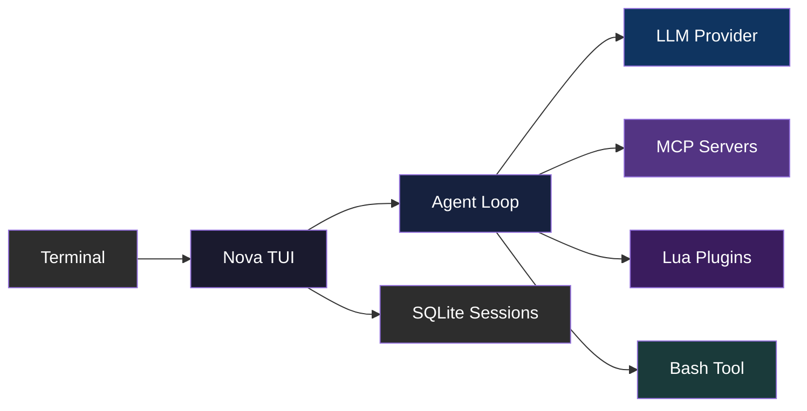

<div align="center">

# Nova

**The terminal AI agent for shipping code.**

[](https://ziglang.org)
[](LICENSE)
[](https://github.com/ozgurulukir/nova-agent/stargazers)

</div>

<!--
  README-ASSET-TODO: Hero visual needed

  What to capture: A terminal recording showing Nova in action — open the TUI,
  type a prompt, watch the agent respond with tool calls. Show the split-view
  lanes and a slash command menu.

  Recommended format: GIF (under 15s, optimized with gifski) or asciinema SVG
  Recommended size: ~1200px wide
  Tools: asciinema (terminal recording), Kap/ScreenToGif (screen capture)
  Save to: docs/assets/hero.gif
-->

Nova is a native terminal UI for working with AI coding agents. It runs in your terminal — no Electron, no browser tab, no Docker. Just a Zig binary that connects to any OpenAI-compatible provider, manages parallel conversation lanes, and keeps your session history in SQLite.

> [!WARNING]
> Alpha software. Things break. Things change. Things get better.

## Features

| Feature | Description |
|---------|-------------|
| **Terminal-native TUI** | Built with [VXFW](https://github.com/vaxis/vaxis) — no Electron, no web tech, just your terminal |
| **Any AI provider** | OpenAI, Anthropic, or any OpenAI-compatible endpoint. Bring your own key. |
| **Parallel lanes** | Run multiple agent conversations side-by-side, merge when ready |
| **MCP tool integration** | Connect any [Model Context Protocol](https://modelcontextprotocol.io) server — stdio or remote |
| **Lua plugin system** | Extend Nova with sandboxed Lua plugins — filesystem, git, JSON, custom tools |
| **Session persistence** | Full conversation history in SQLite. Resume any session, any time. |

## Quick Start

```bash
# Prerequisites: Zig 0.16, uv (Python), huggingface-cli

git clone https://github.com/ozgurulukir/nova-agent.git
cd nova-agent

# Vendor dependencies (fff + ModernBERT classifier)
git clone https://github.com/acecilia/fff.git vendor/fff && make -C vendor/fff
hf download P0u4a/ModernBERT-bash-classifier --local-dir vendor/local-models
uv run python vendor/local-models/export_onnx.py --model-dir vendor/local-models

# Build and run
zig build run
```

Or install to `~/.local/bin/`:

```bash
zig build install -Doptimize=ReleaseFast --prefix $HOME/.local
nova
```

## How It Works



The TUI dispatches events through a modular pipeline — input routing, turn lifecycle, background jobs, and transcript rendering are all separate concerns. The agent loop orchestrates LLM calls, tool execution, and context compaction. Everything is logged to a global SQLite database for session resume and timeline browsing.

## Configuration

Nova uses layered JSON config:

| Layer | File |
|-------|------|
| Global | `~/.config/nova/config.json` |
| Project | `.nova/config.json` |
| Env vars | `NOVA_*` environment variables |

See [docs/CONFIG.md](docs/CONFIG.md) for the full reference.

## Contributing

Contributions are welcome. Read [AGENTS.md](AGENTS.md) for the architecture guide and coding conventions.

```bash
git clone https://github.com/ozgurulukir/nova-agent.git
cd nova-agent
zig build test
```

## License

[MIT](LICENSE)
