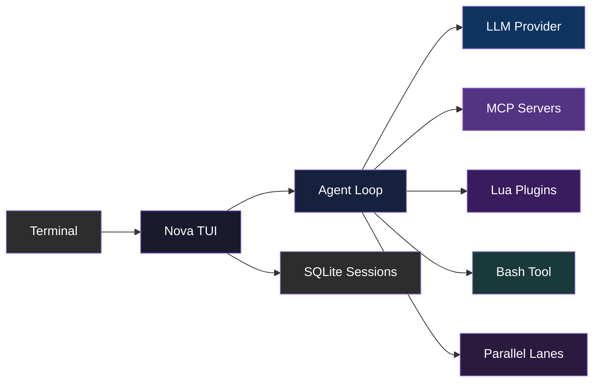

<div align="center">

# Nova

**The terminal AI agent for shipping code.**

[](https://ziglang.org)
[](https://github.com/ozgurulukir/nova-agent/releases)
[](LICENSE)
[](https://github.com/ozgurulukir/nova-agent/stargazers)

</div>

## Nova in action

```text
$ nova

you>  Why does this PR change the cache eviction policy?

agent> Let me find how the cache is managed.

       bash: rg -n "evict|cache" src --type zig
       → src/cache.zig:42:  fn evict(lru: *Lru, key: []const u8) void

agent> The PR replaces random sampling with LRU eviction so hot keys survive
       compaction. The change is isolated to src/cache.zig:42 and covered by
       the test in src/cache_test.zig:11.
```

Nova is a native terminal AI agent for working with code. It runs in your terminal — no Electron, no browser tab, no Docker. Just a Zig binary that connects to any OpenAI-compatible provider, orchestrates parallel work across git worktree lanes, and keeps every session in SQLite.

> [!IMPORTANT]
> Beta software. The core is stable and daily-driven, but edges are still being hardened. APIs and config formats may shift before 1.0. Things get better.

## Why Nova?

- **Runs where you already work.** A native TUI built with [VXFW](https://github.com/vaxis/vaxis) — no Electron, no web stack, no container to babysit.
- **Local-first.** Every conversation is recorded in a SQLite database on your machine. Resume any session, browse its full timeline tree, or export it as Markdown.
- **Bring your own provider.** OpenAI, Anthropic, or any OpenAI-compatible endpoint (Ollama, llama.cpp, OpenRouter, Cerebras, ...). Bring your own key, no lock-in.
- **Think in parallel.** Fork your workspace into isolated git worktree lanes, run several agents side by side, and merge the winner back. Workers are contained to their worktree — destructive commands stay in their lane.
- **Safe by default.** Dangerous shell commands are gated by a ModernBERT classifier with a built-in local pattern-matching backstop. Anything destructive waits for your approval, and the gate surfaces even when the worker runs in a background lane.
- **Extensible.** Sandboxed Lua plugins and MCP servers (stdio or Streamable HTTP) add tools and data sources without touching the core.

## Features

| Feature | Description |
|---------|-------------|
| **Terminal-native TUI** | Built with [VXFW](https://github.com/vaxis/vaxis) — no Electron, no web tech, just your terminal |
| **Any AI provider** | OpenAI, Anthropic, or any OpenAI-compatible endpoint. Multi-provider catalogue with per-session model selection. |
| **Parallel lanes** | Fork git worktrees into side-by-side agent conversations; workers are contained to their worktree; merge when ready |
| **Reasoning effort** | Per-session reasoning-effort control (minimal / low / medium / high) wired end-to-end through the request path |
| **Bash safety** | ModernBERT ONNX classifier + local destructive-command backstop; destructive ops gated behind approval |
| **Diff viewer** | Full-screen git diff review with inline comments sent back to the agent |
| **MCP integration** | Connect any [Model Context Protocol](https://modelcontextprotocol.io) server — stdio or Streamable HTTP, with custom headers and async connects |
| **Lua plugins** | Extend Nova with sandboxed Lua plugins — filesystem, git, JSON bridge, custom tools, event hooks, prompt injection |
| **Session persistence** | Full conversation history in SQLite. Resume any session, browse the timeline tree, rename or delete past sessions. |
| **Context compaction** | Non-blocking context compaction with calibrated retention budgets — keeps long sessions under the model's context window without losing your place |
| **Background jobs** | Run shell commands in the background; results land as messages when the owning lane is idle |

## Getting around

Type a prompt and press Enter. A leading `/` opens the command palette; `@file` attaches a file's contents, `$skill` invokes a skill.

| Shortcut | What it does |
|----------|--------------|
| `/` | Open the command palette |
| `@file` | Attach a file's contents to the prompt |
| `$skill` | Invoke a specialized skill |
| `Ctrl+↑ / Alt+↑` | Previous prompt in history |
| `Ctrl+↓ / Alt+↓` | Next prompt in history |
| `Shift+↓` | Jump to bottom of conversation |
| `Ctrl+F` | Search the current transcript |
| `Ctrl+O` | Background jobs & logs |
| `Shift+Tab` | Cycle through parallel lanes |
| `Ctrl+L` | Fullscreen / split lane view |
| `Ctrl+V / Shift+Ins` | Paste from the system clipboard |
| `Tab` | Expand / collapse active message |
| `Esc` | Cancel turn / unselect / close |

Slash commands: `/connect` (providers & keys), `/model` (model & reasoning effort), `/settings` (config editor), `/new` and `/resume` (sessions), `/timeline` (session tree browser), `/parallel` and `/lanes` (parallel work), `/diff` (diff review & comments), `/save` (git-shadow snapshot), `/export` (Markdown), `/status`, `/skills`, `/copy`, `/paste`, `/clear`, `/help`, `/exit`.

## Quick Start

```bash
# Prerequisites: Zig 0.16, uv (Python), huggingface-cli

git clone https://github.com/ozgurulukir/nova-agent.git
cd nova-agent

# Vendor dependency (ModernBERT classifier only; fzy ships in-tree)
hf download P0u4a/ModernBERT-bash-classifier --local-dir vendor/local-models/ModernBERT-bash-classifier
uv run --project vendor/local-models python vendor/local-models/export_onnx.py \
  --model-dir vendor/local-models/ModernBERT-bash-classifier \
  --output vendor/local-models/ModernBERT-bash-classifier/model.onnx

# Build and run
zig build run
```

Or install to `~/.local/bin/`:

```bash
zig build install -Doptimize=ReleaseFast --prefix $HOME/.local
nova
```

> The ModernBERT bash-safety classifier is optional at runtime — bash safety falls back to a local pattern matcher when it's absent.

### Windows

Nova **compiles** on Windows — `zig build` produces `zig-out/bin/nova.exe`. Full **runtime** support on Windows is still in progress; the binary builds but does not yet run end-to-end. The remaining runtime work is tracked in the follow-up issues:

- [#26](https://github.com/ozgurulukir/nova-agent/issues/26) — runtime config paths (`~/.config/nova` → `%APPDATA%\nova`)
- [#27](https://github.com/ozgurulukir/nova-agent/issues/27) — bash tool spawns `cmd.exe`/`pwsh.exe` instead of `/bin/sh`
- [#28](https://github.com/ozgurulukir/nova-agent/issues/28) — 43 failing tests (bash/git/path-separator runtime differences)
- [#29](https://github.com/ozgurulukir/nova-agent/issues/29) — ModernBERT Python worker and lane/worktree subsystems

Linux behavior is unchanged.

## How It Works



The TUI dispatches events through a modular pipeline — input routing, turn lifecycle, background jobs, lane bridge, and transcript rendering are all separate concerns. The agent loop orchestrates LLM calls (with retry/backoff and a shared concurrent-request limiter across lanes), tool execution (schema-validated), and context compaction. Everything is logged to a global SQLite database for session resume and timeline browsing.

## Configuration

Nova uses layered JSON config:

| Layer | File |
|-------|------|
| Global | `~/.config/nova/config.json` |
| Project | `.nova/config.json` |
| Env vars | `OPENAI_*` and `NOVA_*` environment variables |

See [docs/CONFIG.md](docs/CONFIG.md) for the full reference.

## Extending Nova

When the shell is not the most natural fit, add your own tools with a Lua plugin — no core changes. Drop a `plugin.lua` manifest and an `init.lua` into `.nova/plugins/<name>/`, and register a tool:

```lua
-- .nova/plugins/my-tools/init.lua
nova.register_tool({
  name = "greet",
  description = "Returns a friendly greeting",
  parameters = { name = { type = "string", description = "The name to greet" } },
  handler = function(params)
    return "Hello, " .. (params.name or "World") .. "!"
  end,
})
```

The tool appears in the agent's tool list as `lua__my-tools__greet` and is invoked like any other. Plugins can also hook events, inject system-prompt fragments, and use the `nova.json_decode`/`nova.json_encode` bridge for structured data. Prefer an existing ecosystem? MCP servers plug in with a few lines of config — stdio or Streamable HTTP, with custom request headers for authenticated endpoints. See [docs/MCP.md](docs/MCP.md) and [docs/plugins/](docs/plugins/) for the full guides.

## Under the hood

- [docs/ARCHITECTURE.md](docs/ARCHITECTURE.md) — how the pieces fit together
- [docs/PHILOSOPHY.md](docs/PHILOSOPHY.md) — design principles
- [docs/PATTERNS.md](docs/PATTERNS.md) — codebase patterns and engineering notes
- [docs/MCP.md](docs/MCP.md) — connecting MCP servers
- [docs/plugins/](docs/plugins/) — writing Lua plugins

## Contributing

Contributions are welcome. Read [AGENTS.md](AGENTS.md) for the architecture guide and coding conventions.

```bash
git clone https://github.com/ozgurulukir/nova-agent.git
cd nova-agent
zig build test
```

## License

[MIT](LICENSE). Third-party libraries are listed in [attribution.md](attribution.md).
